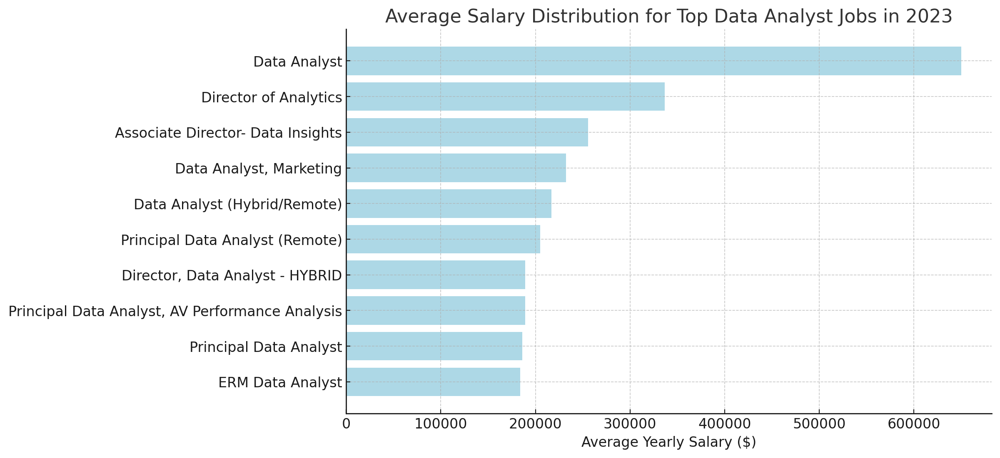
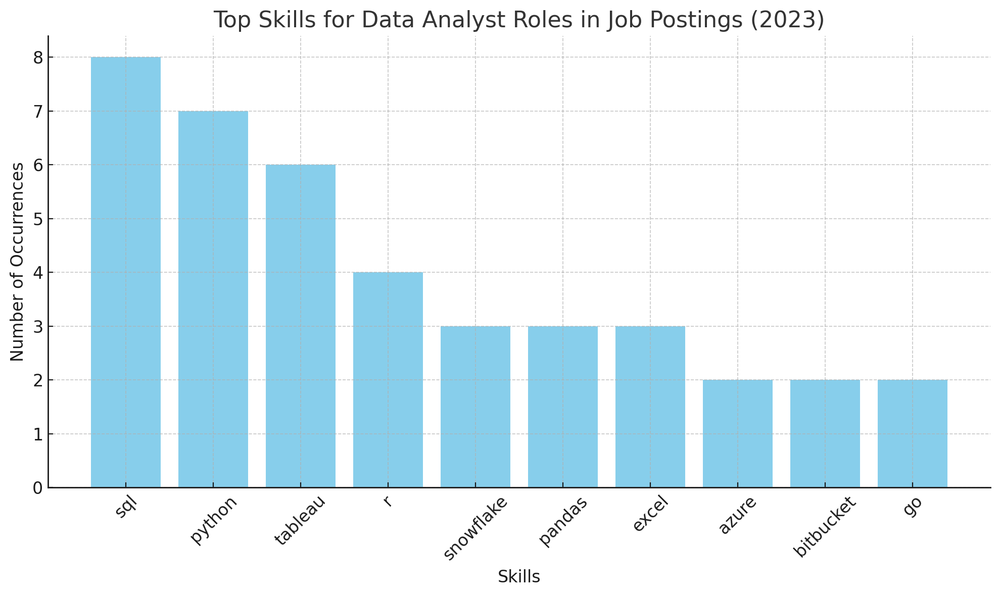

# Introduction
This project explores top-paying jobs, in-demand skills, and optimal skills to learn within the field of data analytics. 

SQL Queries? Check them out here: [project_sql folder](/project_sql/)
# Background 

Motivated by a need to better understand the data analyst job market, this project aims to identify the highest-paying and most in-demand skills, helping others streamline their search for the best job opportunities.

The data comes from this [SQL Course](https://www.lukebarousse.com/sql). It's filled with insights on job titles, salaries, locations, and key skills. 

### The questions I aimed to explore with my SQL queries were: 

1. What are the top-paying data analyst jobs?
2. What skills are required for these top-paying jobs?
3. What skills are most in demand for data analysts?
4. Which skills are associated with higher salaries? 
5. What are the most optimal skills to learn? 

# Tools I Used 
- **SQL**: The foundation of my analysis, enabling me to query the database and extract key insights.
- **PostgreSQL**: The database management system selected for efficiently managing the job posting data.
- **Visual Studio Code**: My preferred tool for managing the database and running SQL queries.
- **Git & GitHub**: Crucial for version control, sharing SQL scripts, and maintaining collaboration and project tracking.

# The Analysis 
For this project, each query was designed to explore specific elements of the data analyst job market. Here's my approach to each question:

### 1. Top Paying Data Analyst Jobs
To pinpoint the highest-paying roles, I filtered data analyst positions based on average annual salary and location, with an emphasis on remote jobs. This query reveals the top-paying opportunities in the field.

```sql
SELECT  
    job_id,
    job_title,
    job_location,
    job_schedule_type,
    salary_year_avg,
    job_posted_date,
    name AS company_name
FROM
    job_postings_fact
LEFT JOIN company_dim ON job_postings_fact.company_id = company_dim.company_id
WHERE 
    job_title_short = 'Data Analyst' AND
    job_location = 'Anywhere' AND 
    salary_year_avg IS NOT NULL
ORDER BY
    salary_year_avg DESC
LIMIT 10
```
Here's an overview of the key findings on top data analyst jobs in 2023:

**Broad Salary Range**: The top 10 data analyst positions offer salaries ranging from $184,000 to $650,000, highlighting the considerable earning potential in this field.

**Range of Employers**: High salaries are offered by a variety of companies, including SmartAsset, Meta, and AT&T, demonstrating strong demand across multiple industries.

**Variety of Job Titles**: The roles vary widely, from Data Analyst to Director of Analytics, indicating diverse positions and specializations within data analytics.



### 2. Skills for Top Paying Jobs
To identify the skills needed for the highest-paying jobs, I combined the job postings with the skills data, revealing what employers prioritize for high-compensation roles.

```sql
WITH top_paying_jobs AS (
    SELECT  
        job_id,
        job_title,
        salary_year_avg,
        name AS company_name
    FROM
        job_postings_fact
    LEFT JOIN company_dim ON job_postings_fact.company_id = company_dim.company_id
    WHERE 
        job_title_short = 'Data Analyst' AND
        job_location = 'Anywhere' AND 
        salary_year_avg IS NOT NULL
    ORDER BY
        salary_year_avg DESC
    LIMIT 10
)

SELECT 
    top_paying_jobs.*,
    skills
FROM top_paying_jobs
INNER JOIN skills_job_dim ON top_paying_jobs.job_id = skills_job_dim.job_id
INNER join skills_dim ON skills_job_dim.skill_id = skills_dim.skill_id
ORDER BY
    salary_year_avg DESC
```
Here’s a summary of the most in-demand skills for the top 10 highest-paying data analyst jobs in 2023:

**SQL** takes the lead with a strong count of 8.

**Python** is a close second, with a count of 7.

**Tableau** is also in high demand, with a count of 6.

Additional skills such as R, Snowflake, Pandas, and Excel show varying levels of demand.



### 3. In-Demand Skills for Data Analysts 
This query revealed the skills most commonly sought in job postings, highlighting areas with high demand.
```sql
SELECT 
    skills,
    COUNT(skills_job_dim.job_id) AS demand_count
FROM job_postings_fact
INNER JOIN skills_job_dim ON job_postings_fact.job_id = skills_job_dim.job_id
INNER join skills_dim ON skills_job_dim.skill_id = skills_dim.skill_id
WHERE 
    job_title_short = 'Data Analyst'
GROUP BY
    skills
ORDER BY
    demand_count DESC
LIMIT 5
```
Here’s an overview of the most in-demand skills for data analysts in 2023:

**SQL** and **Excel** continue to be core skills, underscoring the importance of proficiency in data handling and spreadsheet management.

**Programming** languages and **Visualization** Tools like Python, Tableau, and Power BI are crucial, highlighting the growing significance of technical skills for data storytelling and supporting decision-making.

| Skills    | Demand Count |
|-----------|--------------|
| SQL       | 7,291        |
| Excel     | 4,611        |
| Python    | 4,330        |
| Tableau   | 3,745        |
| Power BI  | 2,609        |

### 4. Skills Based on Salary
Analyzing the average salaries linked to various skills uncovered which ones offer the highest pay.
```sql
SELECT 
    skills,
    ROUND(AVG(salary_year_avg), 2) AS avg_salary
FROM job_postings_fact
INNER JOIN skills_job_dim ON job_postings_fact.job_id = skills_job_dim.job_id
INNER join skills_dim ON skills_job_dim.skill_id = skills_dim.skill_id
WHERE 
    job_title_short = 'Data Analyst' AND
    salary_year_avg IS NOT NULL
    
GROUP BY
    skills
ORDER BY
    avg_salary DESC
LIMIT 25
```
Here's a summary of the results for the top-paying skills for Data Analysts:

**Strong Demand for Big Data & ML Skills**: The highest salaries are earned by analysts proficient in big data tools (PySpark, Couchbase), machine learning platforms (DataRobot, Jupyter), and Python libraries (Pandas, NumPy), highlighting the value placed on data processing and predictive modeling skills in the industry.

**Expertise in Software Development & Deployment**: Proficiency with development and deployment tools (GitLab, Kubernetes, Airflow) shows a profitable intersection between data analysis and engineering, with high value placed on skills that enhance automation and data pipeline efficiency.

**Cloud Computing Skills**: Experience with cloud computing and data engineering tools (Elasticsearch, Databricks, GCP) reflects the increasing importance of cloud-based analytics, suggesting that cloud expertise can significantly enhance earning potential in the field of data analytics.

| Skills        | Average Salary |
|---------------|----------------|
| PySpark       | $208,172.25    |
| Bitbucket     | $189,154.50    |
| Couchbase     | $160,515.00    |
| Watson        | $160,515.00    |
| DataRobot     | $155,485.50    |
| GitLab        | $154,500.00    |
| Swift         | $153,750.00    |
| Jupyter       | $152,776.50    |
| Pandas        | $151,821.33    |
| Elasticsearch | $145,000.00    |
###### *Table of the average salary for the top 10 paying skills for data analysts*

### 5. Optimal Skills to Learn (High Demand + High Salary)
By merging insights from demand and salary data, this query sought to identify skills that are both highly sought-after and well-compensated, providing a strategic direction for skill development.

```sql
SELECT
    skills_dim.skill_id,
    skills_dim.skills,
    COUNT(skills_job_dim.job_id) AS demand_count,
    ROUND(AVG(job_postings_fact.salary_year_avg), 0) AS avg_salary
FROM job_postings_fact
INNER JOIN skills_job_dim ON job_postings_fact.job_id = skills_job_dim.job_id
INNER join skills_dim ON skills_job_dim.skill_id = skills_dim.skill_id
WHERE
    job_title_short = 'Data Analyst'
    AND salary_year_avg IS NOT NULL
    AND job_work_from_home = True
GROUP BY 
    skills_dim.skill_id
HAVING
    COUNT(skills_job_dim.job_id) > 10 
ORDER BY
    avg_salary DESC,
    demand_count DESC
LIMIT 25; 
```
Here is a table listing the top 10 skills by average salary:

| Skill ID | Skills      | Demand Count | Average Salary |
|----------|-------------|--------------|----------------|
| 8        | Go          | 27           | $115,320       |
| 234      | Confluence  | 11           | $114,210       |
| 97       | Hadoop      | 22           | $113,193       |
| 80       | Snowflake   | 37           | $112,948       |
| 74       | Azure       | 34           | $111,225       |
| 77       | BigQuery    | 13           | $109,654       |
| 76       | AWS         | 32           | $108,317       |
| 4        | Java        | 17           | $106,906       |
| 194      | SSIS        | 12           | $106,683       |
| 233      | Jira        | 20           | $104,918       |
###### *Table of the most optimal skills for data analysts sorted by salary*

Here’s an overview of the most strategic skills for Data Analysts in 2023:

**In-Demand Programming Languages**: Python and R lead in popularity, with demand counts of 236 and 148, respectively. While they are highly valued, their average salaries of $101,397 for Python and $100,499 for R suggest these skills are common in the market.

**Cloud and Big Data Tool**s**: Skills in technologies like Snowflake, Azure, AWS, and BigQuery are in demand and command competitive salaries, reflecting the growing role of cloud platforms and big data tools in data analytics.

**Data Visualization and BI Tools**: Tools such as Tableau and Looker, with demand counts of 230 and 49 and average salaries around $99,288 and $103,795, highlight their importance in translating data into actionable insights.

**Database Management Skills**: Proficiency in both traditional and NoSQL databases (Oracle, SQL Server, NoSQL) remains crucial, with average salaries between $97,786 and $104,534, underscoring the ongoing demand for skills in managing and retrieving data.

# What I Learned
**Advanced Query Skills**: Perfected the use of complex SQL techniques, seamlessly joining tables and utilizing WITH clauses for expert temporary table operations.

**Data Aggregation**: Mastered the use of GROUP BY and employed aggregate functions like COUNT() and AVG() to efficiently summarize data.

**Analytical Expertise**: Enhanced my problem-solving abilities by transforming real-world questions into powerful, insightful SQL queries.

# Conclusions

**Insights**

From the analysis, several general insights emerged:

1. **Highest-Paying Data Analyst Roles**: The most lucrative data analyst positions, particularly those offering remote work, present a broad salary range, with the top reaching $650,000!

2. **Skills Needed for Top Salaries**: High-paying data analyst roles often require advanced SQL skills, highlighting it as crucial for securing top-tier earnings.

3. **Most Sought-After Skills**: SQL is the most in-demand skill in the data analyst job market, making it a must-have for job seekers.

4. **Skills Linked to Higher Salaries**: Niche skills like SVN and Solidity command the highest average salaries, indicating a higher value placed on specialized expertise.

5. **Skills Maximizing Market Value**: SQL stands out as both highly demanded and well-compensated, making it a key skill for data analysts to boost their market value.

**Closing Thoughts**

This project sharpened my SQL skills and offered valuable insights into the data analyst job market. The analysis results provide a roadmap for prioritizing skill development and job search strategies. By focusing on skills that are both in high demand and command high salaries, aspiring data analysts can position themselves more effectively in a competitive market. This exploration emphasizes the need for continuous learning and staying current with emerging trends in data analytics.